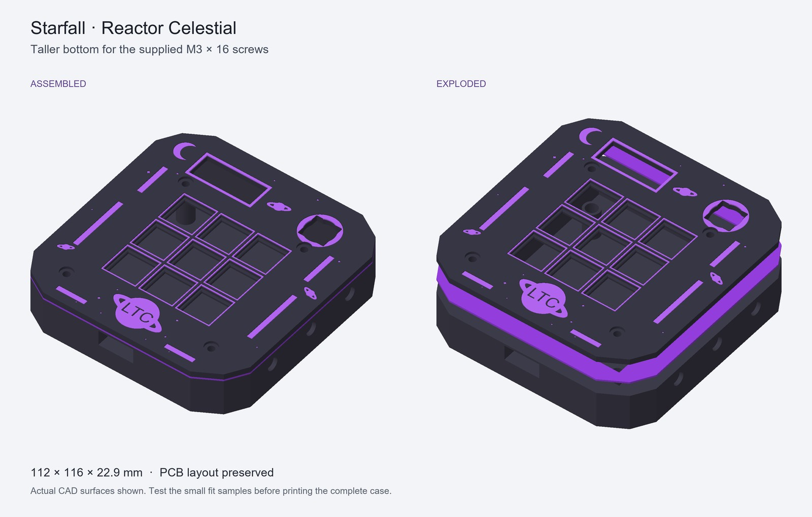

# Starfall

Starfall is my first hardware project. I wanted to make a macropad because it seemed cool, and I chose to use my favorite colors, black and purple, along with my group name, **LTC**. This was a cool but long project, and I learned a lot while making it.

## What it is

Starfall is a 9-key macropad with a rotary encoder and a small OLED display. I designed it around a Seeed Studio XIAO RP2040 and made a custom PCB and case for it.

The macropad has three modes:

- **Everyday** — shortcuts for normal computer use
- **Gaming** — keys for games
- **Coding** — shortcuts for VS Code and Python

The bottom-right key changes between the three modes, and the OLED shows which mode is active.

## Design

I wanted Starfall to have a black and purple space-themed look. The final **Reactor Celestial** case uses a black shell with purple accents, moons, ringed planets, stars, purple key symbols, and **LTC** built into the large purple planet at the front. The encoder also has a purple accent ring.

## Hardware

- Seeed Studio XIAO RP2040
- 9 MX-compatible switches
- 9 1N4148 diodes
- 0.91-inch SSD1306 I2C OLED
- EC11 rotary encoder
- Custom 2-layer PCB
- Custom 3D-printed case
- 9 keycaps
- M3 screws and heat-set inserts

## Firmware

The firmware uses **KMK / CircuitPython**.

The three layers are:

### Everyday
Copy, paste, cut, undo, redo, select all, screenshot, media play/pause, and mode change.

### Gaming
A set of gaming keys plus the mode-change key.

### Coding
VS Code shortcuts such as run, debug, format, comment, terminal, split editor, command palette, quick open, and mode change.

## PCB

### Schematic

### PCB layout

### Front 3D view

### Back 3D view

### Gerber check

## Case

The final case is **Starfall Reactor Celestial**. It is split into separate printable pieces:

- black top — `production/Top.STEP`
- black bottom — `production/Bottom.STEP`
- purple middle spacer — `production/Middle_Purple.STEP`
- purple moons, planets, stars, rails, and LTC planet — `production/Purple_Inlays.STEP`

The case also has mounting holes, M3 screw holes, heat-set insert pockets, a USB-C opening, OLED opening, encoder opening, and switch openings. The small planet on the right side is positioned between the reactor rails so it does not collide with them.

### 3D case assembly

The older screenshots and `CAD/Starfall_assembled.STEP` / `CAD/Starfall_case_assembly.STEP` describe earlier case versions. Use the files below for the current Reactor Celestial case.

The final colored case assembly is `CAD/Starfall_Reactor_Celestial_FINAL_COLORED_CASE.STEP`, and the full-color preview with keycaps and hardware is `CAD/Starfall_Reactor_Celestial_FINAL_FULL_COLOR.glb`.

The deeper bottom retains the supplied **M3 x 16 mm screws**. The enclosure measures **112 x 116 x 22.9 mm**. Install inserts at their recessed seats before installing the PCB: the insert top is **6.9 mm below each support-post top**, not flush with that top.

The current electronics-fit assembly is [`CAD/Starfall_Mechanical_Assembly.STEP`](CAD/Starfall_Mechanical_Assembly.STEP), using a 1.60 mm board reference. Mechanical checks are recorded in [`production/MECHANICAL_VALIDATION.json`](production/MECHANICAL_VALIDATION.json). CAD clearance checks do not certify actual switch retention, insert fit, cable molds or printer tolerance.

Read [`CAD/MECHANICAL_NOTES.md`](CAD/MECHANICAL_NOTES.md) and print the small [`fit samples`](production/fit_coupons/README.md) before the complete case. For separate single-colour accent printing, use `production/Purple_Inlays_Print_Layout.STEP`; `Purple_Inlays.STEP` preserves assembled placement for assembly or multi-material workflows.

## Bill of Materials

| Item | Qty | Part / Specification | Notes |
| --- | ---: | --- | --- |
| Microcontroller | 1 | Seeed Studio XIAO RP2040 | Hackpad MCU |
| Mechanical switch | 9 | MX-compatible PCB-mount switch | 1u switches |
| Diode | 9 | 1N4148 DO-35 through-hole | One per key |
| Rotary encoder | 1 | EC11E, 20 mm D-shaft | Encoder input |
| OLED | 1 | 0.91 in 128x32 SSD1306 I2C | 4-pin module |
| Keycap | 9 | 1u MX keycaps | 9 total |
| Encoder knob | 1 | D-shaft knob sized for EC11E | Knob for encoder |
| M3 screw | 4 | M3 x 16 mm | Deeper bottom; checked head envelope is diameter 5.5 x height 3 mm |
| Heat-set insert | 4 | M3 x 5 x 4 mm insert | 4.7 x 4.1 mm pocket below a 5.8 mm installation well |
| PCB | 1 | Starfall 2-layer PCB, 84.89 x 96.94 mm | Gerbers in `production/` |
| Case: black | 1 set | `Top.STEP` + `Bottom.STEP` | 3D printed |
| Case: purple | 1 set | `Middle_Purple.STEP` + `Purple_Inlays.STEP` | 3D printed accents |

The full BOM with source/reference links is also available in [`BOM.csv`](BOM.csv).

## Files

- `PCB/` — KiCad schematic, PCB, and project files
- `CAD/` — case, assemblies, and full-color GLB preview
- `production/` — final STEP/STL case parts, Gerbers, print-ready check, and `main.py`
- `Firmware/` — KMK firmware source
- `assets/` — project screenshots and graphics
- `tools/` — reproducible final-case generator
- `BOM.csv` — bill of materials with reference links

## What I learned

This was my first project, so I learned a lot about KiCad, schematics, PCB routing, key matrices, diodes, 3D models, case design, Gerbers, and firmware. It took a while, but seeing the whole project come together was worth it.
